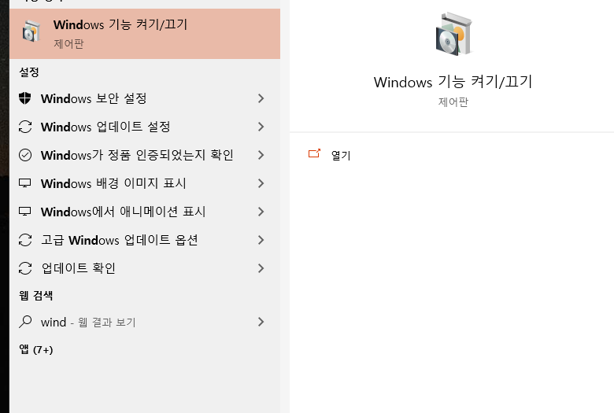
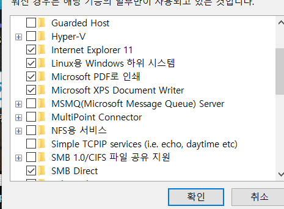
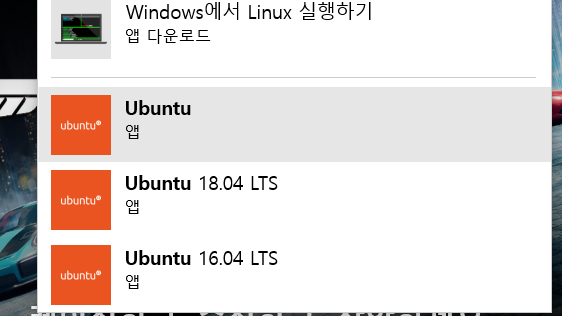

```
sudo vi etc/apt/sources.list
```

```
:
%s/archive.ubuntu.com/ftp.daumkakao.com/g
:
%s/security.ubuntu.com/ftp.daumkakao.com/g
```

```
## wsl prompt(vscode or ubuntu)

sudo apt-get update
sudo apt full-upgrade

## take times
```

```
## 선택사항일듯 // 시간 꽤 걸림

sudo apt-get install build-essential libncurses5 libncurses5-dev kernel-package bin86 libssl-dev ftpd ssh
```

```
## wsl prompt

curl -sL https://deb.nodesource.com/setup_10.x | sudo -E bash -

sudo apt-get install nodejs

## 그냥 깔면 예전버전깔림
```

